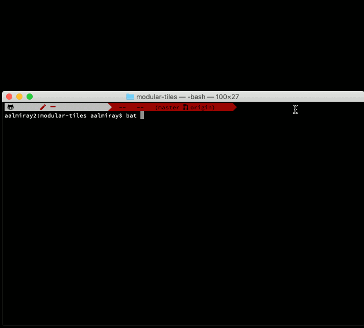
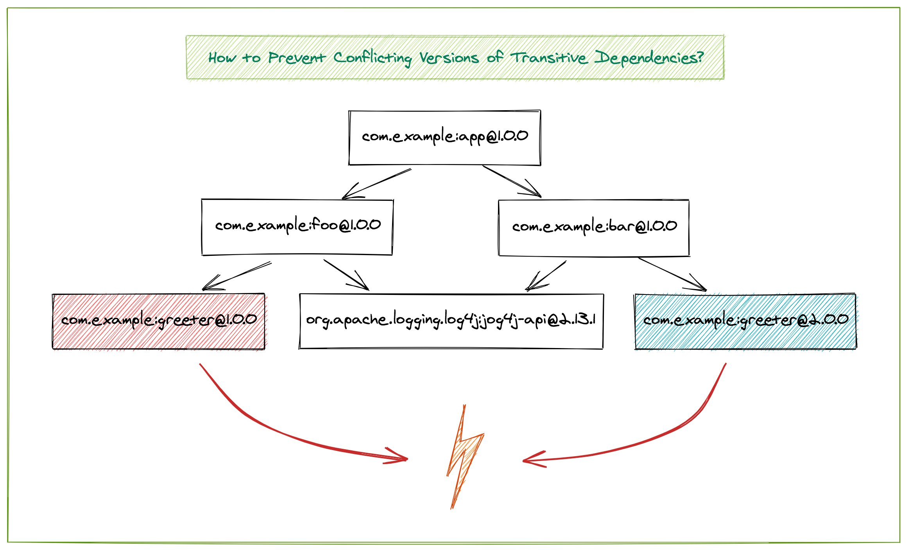

= Layrry - A Launcher and API for Modularized Java Applications
:linkattrs:
:project-owner:   moditect
:project-name:    layrry
:project-group:   org.moditect.layrry
:project-version: 1.0.0.Final

image:https://github.com/{project-owner}/{project-name}/workflows/Build/badge.svg["Build Status", link="https://github.com/{project-owner}/{project-name}/actions"]
image:https://img.shields.io/maven-central/v/{project-group}/{project-name}-core.svg[Download, link="https://search.maven.org/#search|ga|1|{project-group}"]

_Latest version: {project-version}_

http://andresalmiray.com/layrry-1-0-0-alpha1-has-been-released/[1.0.0.Alpha1 announcement]

Layrry is a launcher and Java API for executing modularized Java applications.

It allows to assemble modularized applications based on Maven artifact coordinates of the (modular) JARs to include.
Layrry utilizes the Java Module System's notion of link:https://docs.oracle.com/en/java/javase/11/docs/api/java.base/java/lang/ModuleLayer.html[module layers],
allowing multiple versions of one module to be used within an application at the same time, as well as dynamically adding
and removing modules at application runtime.

The module graph is built either declaratively (using YAML or TOML descriptors) or programmatically (using a fluent API).

Learn more about Layrry in these blog posts:

* link:https://www.morling.dev/blog/introducing-layrry-runner-and-api-for-modularized-java-applications/[Introducing Layrry: A Launcher and API for Modularized Java Applications]
* link:https://www.morling.dev/blog/plugin-architectures-with-layrry-and-the-java-module-system/[Plug-in Architectures With Layrry and the Java Module System]
* link:https://www.morling.dev/blog/class-unloading-in-layered-java-applications/[Class Unloading in Layered Java Applications]
* link:http://andresalmiray.com/building-a-layered-modular-java-application-watch-out-for-these/[Building a layered modular Java application? Watch out for these!]

Layrry also was presented at different (online) conferences and meet-ups, for example at vJUG (https://speakerdeck.com/gunnarmorling/plug-in-architectures-with-layrry-and-the-java-module-system-vjug[slides], https://www.youtube.com/watch?v=iJyys_LgG-U[recording]).

== Why Layrry?

The Java Module System doesn't define any means of mapping between modules (e.g. _com.acme.crm_) and JARs providing such module
(e.g. _acme-crm-1.0.0.Final.jar_) or retrieving modules from remote repositories using unique identifiers
(e.g. _com.acme:acme-crm:1.0.0.Final_). Instead, it's the responsibility of the user to obtain all required JARs of a modularized
application and provide them via `--module-path`.

Furthermore, the module system doesn't define any means of module versioning; i.e. it's the responsibility of the user to
obtain all modules in the right version. Using the `--module-path` option, it's not possible, though, to assemble an
application that uses multiple versions of one and the same module. This may be desirable for transitive dependencies of
an application, which might be required in different versions by two separate direct dependencies.

This is where Layrry comes in: utilizing the notion of module layers, it provides a declarative approach as well as an API
for assembling modularized applications, organized in module layers. The JARs to be included are described using Maven GAV
(group id, artifact id, version) coordinates, solving the issue of retrieving all required JARs in the right version.

Module layers allow to use different versions of one and the same module in different layers of an application (as long as
they are not exposed in a conflicting way on module API boundaries).

Module layers and thus Layrry also allow application extensions to be added and removed dynamically at runtime. Here's
link:https://github.com/moditect/layrry-examples/tree/master/modular-tiles[an example] for using the Layrry plug-in API
to dynamically modify a JavaFX application:

== Using the Layrry Launcher

The Layrry Launcher is a CLI tool which takes a configuration of a layered application and executes it. It's used like so:

[source]
[subs="attributes"]
----
layrry-launcher-{project-version}-all.jar --layers-config <path/to/layers.yml> [program arguments]
----

E.g. like so:

[source]
[subs="attributes"]
----
layrry-launcher-{project-version}-all.jar --layers-config hello-world.yml Alice Bob
----

The application layers configuration file is a YAML file which the following structure:

[source,yaml]
----
layers:
  <name 1>:
    modules:
      - "G:A:V"
      - "G:A:V"
      - ...
  <name 2>:
    parents:
      - "<name 1>"
    modules:
      - ...
      - ...
  <name 3>:
    parents:
      - "<name 2"
    directory: "relative/path/to/directory/of/layer/directories

main:
  module: <main module>
  class: <main class>
----

Each layer comprises:

* A unique name
* The list of parent layers
* The list of contained modules given via Maven GAV coordinates OR
* A directory which contains one or more sub-directories, each of which represent one layer made up of the modular JARs 
within that sub-directory; the directory path is resolved relatively to the location of the _layrry.yml_ file. Alternatively
the directory may be an absolute path however *be very careful* as this may cause a non portable configuration.

As an example, consider the following application whose modules `foo` and `bar` depend on two different versions of the `greeter` module:

Running this application wouldn't be possible with the default module path, which only allows for one version of a given
module. Here is how the application can be executed via Layrry, organizing all the modules in multiple layers:

[source,yaml]
----
layers:
  log:
    modules:
      - "org.apache.logging.log4j:log4j-api:2.20.0"
      - "org.apache.logging.log4j:log4j-core:2.20.0"
      - "com.example:logconfig:1.0.0"
  foo:
    parents:
      - "log"
    modules:
      - "com.example:greeter:1.0.0"
      - "com.example:foo:1.0.0"
  bar:
    parents:
      - "log"
    modules:
      - "com.example:greeter:2.0.0"
      - "com.example:bar:1.0.0"
  app:
    parents:
      - "foo"
      - "bar"
    modules:
      - "com.example:app:1.0.0"
main:
  module: com.example.app
  class: com.example.app.App
----

Alternatively you may use TOML instead of YAML

[source,toml]
----
[layers.log]
  modules = [
    "org.apache.logging.log4j:log4j-api:2.20.0",
    "org.apache.logging.log4j:log4j-core:2.20.0",
    "com.example.it:it-logconfig:1.0.0"]
[layers.foo]
  parents = ["log"]
  modules = [
    "com.example.it:it-greeter:1.0.0",
    "com.example.it:it-foo:1.0.0"]
[layers.bar]
  parents = ["log"]
  modules = [
    "com.example.it:it-greeter:2.0.0",
    "com.example.it:it-bar:1.0.0"]
[layers.app]
  parents = ["foo", "bar"]
  modules = ["com.example.it:it-app:1.0.0"]
[main]
  module = "com.example.app"
  class = "com.example.app.App"
----

Be sure to use `.toml` as file extension to let Layrry know which format should be parsed.

You can find the complete example in the tests of the Layrry project.

The Layrry Launcher accepts the following arguments:

 * --basedir: The base directory from which plugin directories will be resolved. Layrry will use the parent directory of 
 the layers config file if this value is not set.
 * --layers-config: Path to the layers config file. The file must use any of the supported config formats. REQUIRED.
 * --properties: Path to additional properties in Java `.properties` format. These properties will be used to replace value
 placeholders found in the layers config file. OPTIONAL.

== Using JBang

link:https://github.com/jbangdev/jbang[JBang] can launch self contained Java sources, JShell scripts, JARs. jbang has a feature
that allows you to try out Layrry without having to install or build Layrry yourself. You only need a JDK (11+ is preferred)
and jbang installed. Once you do, you may invoke the previous example with

[source]
----
jbang layrry@moditect --layers-config layers.yml
----

JBang will resolve and download the appropriate Layrry bootstrap binary, then Layrry resolves the modules described in
the input configuration file, finally the application is launched.

== Dynamic Plug-Ins

Layrry also supports the dynamic addition and removal of plug-ins at runtime. For that, simply add or remove plug-in
sub-directories to the `directory` of a layer configuration. Layrry watches the given plug-ins directory and will add or
remove the corresponding module layer to/from the application in case a new plug-in is added or removed. The core of an
application can react to added or removed module layers. In order to do so, the module _org.moditect.layrry:layrry-platform_
must be added to the application core layer and an implementation of the `PluginLifecycleListener` interface must be
created and registered as service:

[source]
----
public interface PluginLifecycleListener {
    void pluginAdded(PluginDescriptor plugin);

    void pluginRemoved(PluginDescriptor plugin);
}
----

Typically, an application will retrieve application-specific services from newly added module layers:

[source,java]
----
@Override
public void pluginAdded(PluginDescriptor plugin) {
  ServiceLoader<MyService> services = ServiceLoader.load(
      plugin.getModuleLayer(), MyService.class);

    services.forEach(service -> {
      // only process services declared by the added layer itself, but not
      // from ancestor layers
      if (service.getClass().getModule().getLayer() == layer) {
        // process service ...
      }
    });
}
----

To avoid class-loader leaks, it's vital that all references to plug-in contributed classes are released upon `pluginRemoved()`.
Note that classes typically will not instantly be unloaded, but only upon the next full GC (when using G1).

You can find a complete example for the usage of dynamic plug-ins in the _vertx-example_ directory: "Layrry Links" is an
example application for managing golf courses, centered around a web application core built using Vert.x. Routes of the
web application (_/members_, _/tournaments_) are contributed by plug-ins which can be added to or removed from the
application at runtime. The _routes_ path shows all routes available at a given time.

Plugins may be packaged in 3 ways:

1. As a single JAR file. No nested JARs are allowed.
2. As a Zip file. Multiple JARs may be packaged.
3. As a Tar(.gz) file. Multiple JARs may be packaged.

For Zip and Tar packages, the use of a root entry matching the name of containing file is permited, however it's preferred
if said root entry were omitted. Some examples:

[source]
.Single JAR
----
plugin-1.0.jar
 |- com
 |- com/acme
 |- com/acme/Plugin.class
 \- module-info.class
----

[source]
.Plain Zip (or Tar)
----
plugin-1.0.zip
 |- plugin-1.0.jar
 |- dependency-foo-1.0.0.jar
 \- dependency-bar-1.0.0.jar
----

[source]
.Root Zip (or Tar)
----
plugin-1.0.zip
 |- plugin-1.0
 |- plugin-1.0/plugin-1.0.jar
 |- plugin-1.0/dependency-foo-1.0.0.jar
 \- plugin-1.0/dependency-bar-1.0.0.jar
----

== Parameterized Layer Configuration

Layrry supports the link:https://github.com/spullara/mustache.java[Mustache] template syntax, enabling parameterization of
the content found in configuration files, regardless of their target format (YAML, TOML, etc). To use this feature you must
use a `{{property}}` expression to refer to value placeholders. Layrry makes all `System` properties available for value
replacement, as well as an extra set of properties that are related to OS values; these include all properties exposed by
the link:https://github.com/trustin/os-maven-plugin/[os-maven-plugin]. If the `--properties` command flag is passed to the
Layrry Launcher then all properties found in the given properties file will also become available.

Additionally, Layrry resolves the following properties

 * `os.detected.jfxname`: specific to JavaFX. Values may be one of `linux`, `win`, `mac`.
 * `os.detected.lwjglname`: specific to LWJGL. Values may be one of `linux`, `linux-arm32`, `windows`, `windows-x86`, `macosx`.

The following example shows a parameterized TOML config file for a JavaFX application that can be run on any of the 3 platforms
supported by JavaFX

[source,toml]
----
.layers.toml
[layers.javafx]
    modules = [
        "org.openjfx:javafx-base:jar:{{os.detected.jfxname}}:{{javafx_version}}",
        "org.openjfx:javafx-controls:jar:{{os.detected.jfxname}}:{{javafx_version}}",
        "org.openjfx:javafx-graphics:jar:{{os.detected.jfxname}}:{{javafx_version}}",
        "org.openjfx:javafx-web:jar:{{os.detected.jfxname}}:{{javafx_version}}",
        "org.openjfx:javafx-media:jar:{{os.detected.jfxname}}:{{javafx_version}}"]
[layers.core]
    modules = [
        "org.kordamp.tiles:modular-tiles-model:{{project_version}}",
        "org.kordamp.tiles:modular-tiles-core:{{project_version}}",
        "org.kordamp.tiles:modular-tiles-app:{{project_version}}",
        "org.moditect.layrry:layrry-platform:{{layrry_version}}",
        "eu.hansolo:tilesfx:{{tilesfx_version}}"]
    parents = ["javafx"]
[layers.plugins]
    parents = ["core"]
    directory = "plugins"
[main]
  module = "org.kordamp.tiles.app"
  class = "org.kordamp.tiles.app.Main"
----

[source,java]
[subs="attributes"]
.versions.properties
----
project_version = 1.0.0
javafx_version = 11.0.2
tilesfx_version = 11.44
layrry_version = {project-version}
----

This application can be launched as

[source]
[subs="attributes"]
----
layrry-launcher-{project-version}-all.jar --layers-config layers.toml --properties versions.properties
----

== Remote Configuration

Layrry supports loading external configuration files (inputs to `--layers-config` and `--properties`) both from local and
remote sources. For example, the previous `layers.toml` and `versions.properties` files could be accessed from a remote server
that exposes those resources via HTTPS, such as

[source]
[subs="attributes"]
----
layrry-launcher-{project-version}-all.jar \
  --basedir /home/user/joe \
  --layers-config https://server:port/path/to/layers.toml \
  --properties https://server:port/path/to/versions.properties
----

It's important to note that setting the `--basedir` config flag is more important when remote layer configuration is in use,
as that ensures plugin directories will be resolved from the same location, otherwise the basedir location will be inferred
as `System.getProperty("user.dir")` which may produce unexpected results when invoked from different locations.

Plugin directories are always local, even if defined in remote layer configuration files. You may mix remote and local
resources as you deem necessary, that is, the following combinations are valid:

[source]
[subs="attributes"]
.All remote
----
layrry-launcher-{project-version}-all.jar \
  --basedir /home/user/joe \
  --layers-config https://server:port/path/to/layers.toml \
  --properties https://server:port/path/to/versions.properties
----

[source]
[subs="attributes"]
.All local
----
layrry-launcher-{project-version}-all.jar \
  --basedir /home/user/joe \
  --layers-config layers.toml \
  --properties versions.properties
----

[source]
[subs="attributes"]
.Mixed
----
layrry-launcher-{project-version}-all.jar \
  --basedir /home/user/joe \
  --layers-config https://server:port/path/to/layers.toml \
  --properties versions.properties
----

[source]
[subs="attributes"]
----
layrry-launcher-{project-version}-all.jar \
  --basedir /home/user/joe \
  --layers-config layers.toml \
  --properties https://server:port/path/to/versions.properties
----

=== Proxy Configuration

You may need to configure a proxy when using the remote configuration feature. The following properties may be used to
configure a proxy:

[options="header"]
|===
| Key                 | Description
| use.proxy           | Whether to use any proxy or not. Defaults to `false`.
| http.proxy          | Whether to use HTTP proxy or not. Defaults to `false`.
| http.proxyHost      | Defaults to empty String.
| http.proxyport      | Defaults to `80`.
| http.proxyUser      | Defaults to empty String.
| http.proxyPassword  | Defaults to empty String.
| http.nonProxyHosts  | Defaults to `localhost\|127.*\|[::1]`.
| https.proxy         | Whether to use HTTPS proxy or not. Defaults to `false`.
| https.proxyHost     | Defaults to empty String.
| https.proxyport     | Defaults to `443`.
| https.proxyUser     | Defaults to empty String.
| https.proxyPassword | Defaults to empty String.
| socks.proxy         | Whether to use SOCKS proxy or not. Defaults to `false`.
| socksProxyHost      | Defaults to empty String.
| socksProxyPort      | Defaults to `1080`.
| socks.proxyUser     | Defaults to empty String.
| socks.proxyPassword | Defaults to empty String.
|===

These properties may be set as `System` properties by passing `-Dkey=value` as part of command line arguments when using
the launcher, or as part of the additional properties file if `--properties` is given as an argument to the launcher.

== Using the Layrry API

In addition to the YAML-based/TOML-based launcher, Layrry provides also a Java API for assembling and running layered applications.
This can be used in cases where the structure of layers is only known at runtime, or for implementing plug-in architectures.

In order to use Layrry programmatically, add the following dependency to your _pom.xml_:

[source,xml]
[subs="attributes,verbatim"]
----
<dependency>
    <groupId>org.moditect.layrry</groupId>
    <artifactId>layrry</artifactId>
    <version>{project-version}</version>
</dependency>
----

Then, the Layrry Java API can be used like this (showing the same example as above):

[source,java]
----
Layers layers = Layers.builder()
    .layer("log")
        .withModule("org.apache.logging.log4j:log4j-api:2.20.0")
        .withModule("org.apache.logging.log4j:log4j-core:2.20.0")
        .withModule("com.example:logconfig:1.0.0")
    .layer("foo")
        .withParent("log")
        .withModule("com.example:greeter:1.0.0")
        .withModule("com.example:foo:1.0.0")
    .layer("bar")
        .withParent("log")
        .withModule("com.example:greeter:2.0.0")
        .withModule("com.example:bar:1.0.0")
    .layer("app")
        .withParent("foo")
        .withParent("bar")
        .withModule("com.example:app:1.0.0")
    .build();

layers.run("com.example.app/com.example.app.App", "Alice");
----

== Configuring Artifact Resolution

Layrry relies on Maven's API to resolve artifacts. By default, Maven Local, Maven Central and every other setting configured
at `~/.m2/settings.xml` are available to Layrry. You can tweak and configure those settings by editing the `~/.m2/settings.xml`
file. Alternatively you may instruct Layrry to use a different configuration file, skip querying Maven Central, or stop
all resolutions via remote repositories.

=== Disable All Remote Maven Repositories

[source,java]
.Java
----
Layers layers = Layers.builder()
    .resolve(Resolvers.remote().workOffline(true))
    .layer(...)
----

[source,yaml]
.Yaml
----
resolve:
  workOffline: true
  ...
----

[source,toml]
.Toml
----
[resolve]
  workOffline = true
  ...
----

=== Disable All Remote and Local Maven Repositories

[source,java]
.Java
----
Layers layers = Layers.builder()
    .resolve(Resolvers.remote().enabled(false))
    .layer(...)
----

[source,yaml]
.Yaml
----
resolve:
  remote: false
  ...
----

[source,toml]
.Toml
----
[resolve]
  remote = false
  ...
----

=== Use Alternate Maven Settings File

[source,java]
.Java
----
Layers layers = Layers.builder()
    .resolve(Resolvers.remote()
         .fromFile(Paths.get("/path/to/settings.xml")))
    .layer(...)
----

[source,yaml]
.Yaml
----
resolve:
  fromFile: "/path/to/settings.xml"
  ...
----

[source,toml]
.Toml
----
[resolve]
  fromFile = "/path/to/settings.xml"
  ...
----

== Local Artifact Resolution

Layrry can resolve artifacts from additional local sources. These sources must follow specific layouts for organizing artifacts.
Currently `flat` and `default` layouts are supported, which are provided by Maven and Gradle plugins. Local repositories will
always be queried first, then any remote repositories if available.

=== Flat Layout

This layout organizes all artifacts in a single directory, for example

[source]
----
repodir
 |-- foo-1.0.0.jar
 \-- bar-2.0.0.jar
----

=== Default Layout

This layout organizes all artifacts following the Maven coordinates conventions, for example

[source]
----
repodir
  |-- com
  |    \-- acme
  |        \-- foo
  |            \-- 1.0.0
  |                \-- foo-1.0.0.jar
  \-- org
       \-- random
           \-- bar
               \-- 2.0.0
                   \-- bar-2.0.0.jar
----

=== Use Local Repositories

[source,java]
.Java
----
Layers layers = Layers.builder()
    .resolve(Resolvers.local()
        .withLocalRepo("repoName", Paths.get("/path/to/repository/directory").toAbsolutePath(), "flat"))
    ...
----

[source,yaml]
.Yaml
----
resolve:
  localRepositories:
    repoName:
      layout: "flat"
      path: "/path/to/repository/directory"
----

[source,toml]
.Toml
----
[resolve.localRepositories.repoName]
  layout = "flat"
  path   = "/path/to/repository/directory"
----

The path may be absolute as shown in the examples or relative, in which it will be resolved relative to the
config file path.

== Building Layrry

Layrry can be built from source by running the following command

[source]
----
$ ./mvnw install
----

Java 11 or later is needed in order to do so.

== Contributing

Your contributions to Layrry are very welcomed. Please open issues with your feature suggestions as well as pull requests.
Before working on larger pull requests, it's suggested to reach out to link:https://twitter.com/gunnarmorling[@gunnarmorling].

== License

Layrry is licensed under the Apache License version 2.0.
